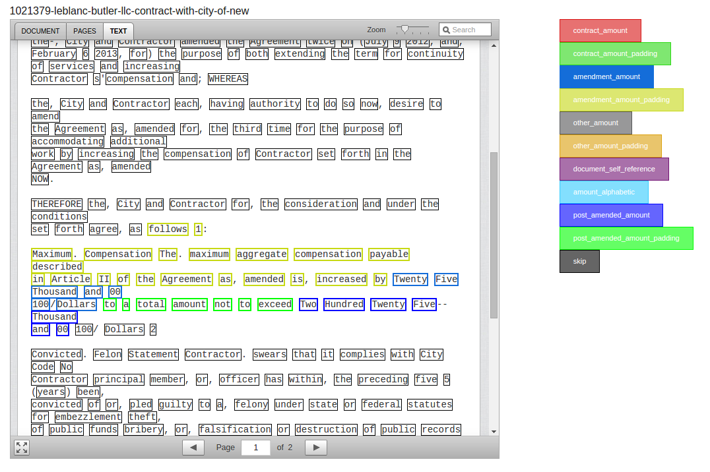

### What is this?

[Parserator](http://www.github.com/datamade/parserator) makes it easy to create custom parsers which label text using probabilistic methods. 

DocumentParserator connects Parserator to [DocumentCloud](http://www.documentcloud.org) so that you can use Parserator to pull out structured data from large corpuses of documents. 

If you have a bunch of similar documents on DocumentCloud and you want to know what they all say: this thing might help you.

DocumentParserator was originally developed in order to help analyze a corpus of 6500 contracts from the City of New Orleans, which all look something like [this](https://www.documentcloud.org/documents/1873385-dawn-e-boudoin-ccr-inc-court-reporting-services.html).

Basically I wanted to take unstructured lines like this

> s of 1110 of an hour. The maximum amount to be paid under this contract is $20,000.00. No amount of  work is guaranteed under this agreement; payments wil

or this

> General Liability insurance will be purchased and maintained with limits of $1,000,000 per occurrence 

and get out structured data like this

    {
      "maximum amount payable": "$20,000.00",
      "liability insurance": "$1,000,000"
    }

### Couldn't I just use a regular expression?
Maybe. If your text data has a very rigid and predictable structure, you might just be able to use a regex to pull out this sort of information. But lots of text has much more complex structures which require more complex methods. 

When I started the New Orleans contracts project, first I tried to just use a regex. Then I tried to use Parserator on little snippets of the contracts. Then I realized that what I really needed was to run Parserator on an entire document so that (1) Parserator could consider the full context in assigning labels and (2) I could easily review and correct its output in one place, using a single UI. 

### Troubleshooting

There are a few hangups with running parserator on a bunch of documents. The first thing is that if you tokenize every word, things run fairly slowly. I wrote this working on a newish machine with 4 processors. I would just use the GNU parallel command to feed a bunch of files to parserator and leave it to run overnight. That worked fine for me. 

Parserator uses conditional random fields, which get slower as you add more tags and more tokens. So another option would be running two passes of parserator: the first one uses really big tokens (as big as paragraphs) and simply labels them as 'interesting' or 'uninteresting'. Then the second pass would parse the interesting paragraphs. I opted not to do that because I'd rather wait for the computer to run than introduce that extra programming complexity.

### Guide to code
 
`webapp` - A simple flask application that generates parserator-ready XML (`webapp/labels`). The front end uses backbone, like Document Cloud.

`parserator` - Stores all of the stuff needed to parse documents. One folder in `/parserator` stores the actual parserator project.

`labeled` - Stores documents that parserator has parsed. Parserator is too slow to do this on the fly while the web app is running. So you need to preprocess the files by running `./documentparserator/parserator/parse.sh`
